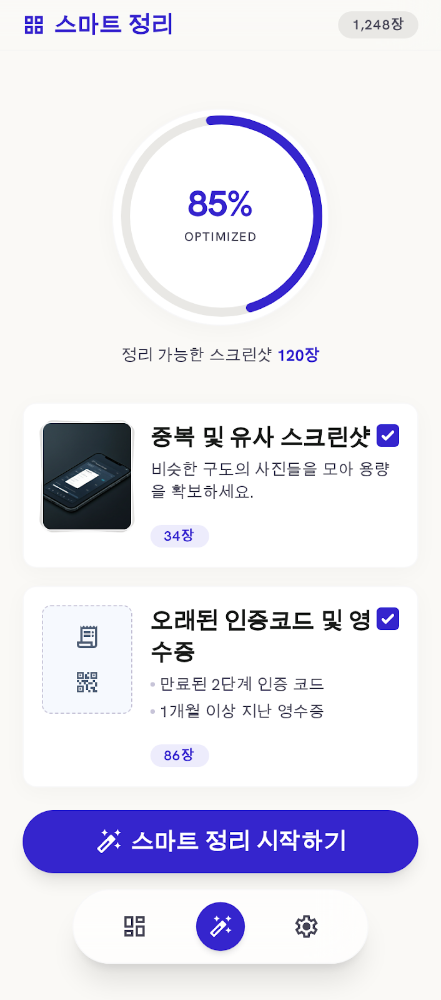
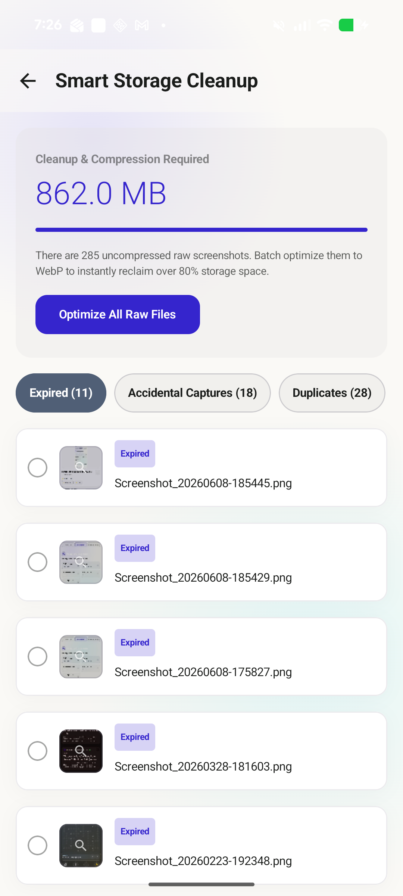
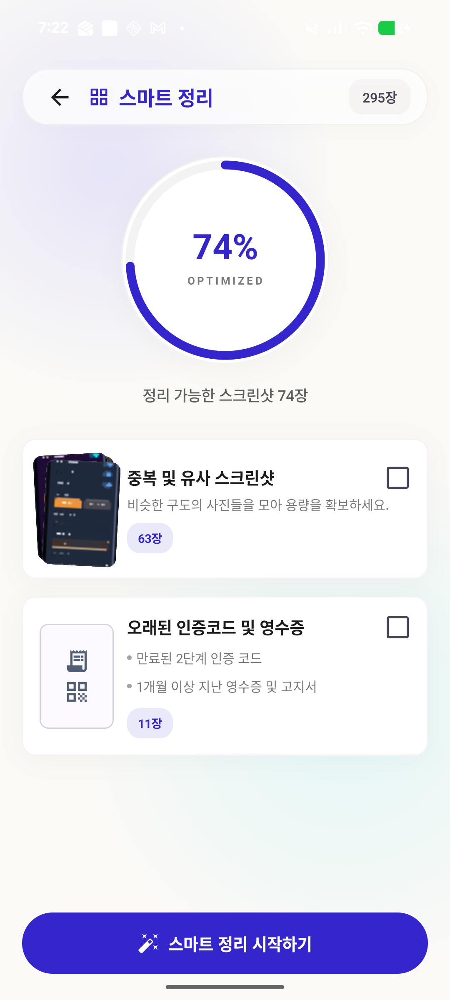
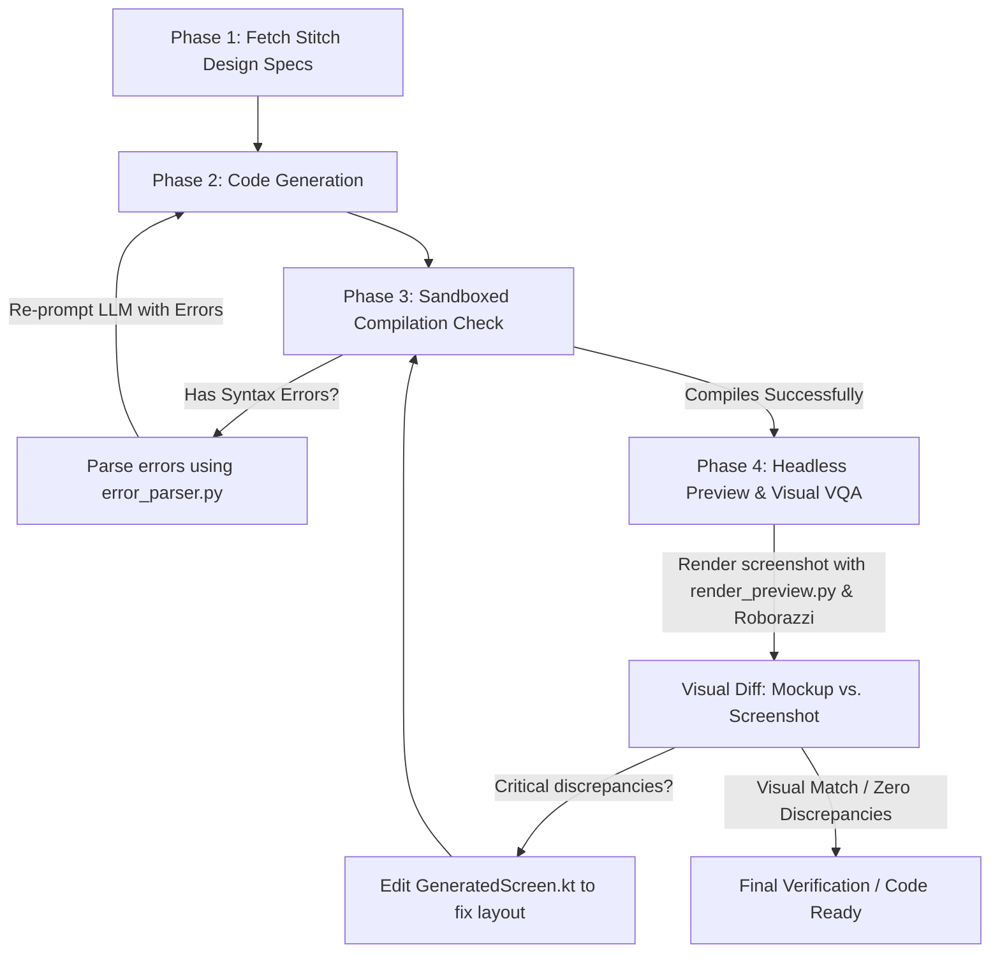

# 🔄 Stitch-to-Compose: AI Self-Healing UI Conversion Loop

[](https://kotlinlang.org/)
[](https://developer.android.com/)
[](https://developer.android.com/jetpack/compose)
[](https://github.com/takahirom/roborazzi)

An agentic AI workflow that programmatically converts UI designs from Google Stitch mockups and specifications into compiling, visually accurate, and production-ready Jetpack Compose code.

Through a closed-loop integration of **compiler error parsing** and **headless screenshot testing (Visual VQA)**, the agent automatically heals syntax, layout, and styling discrepancies without human intervention.

---

## ✨ Key Features & Capabilities

* **🤖 Self-Healing Compilation**: Automatically compiles modules, parses compiler logs with [error_parser.py](stitch-to-compose-loop/scripts/error_parser.py), and loops until compilation succeeds.
* **📸 Headless Visual Validation**: Automatically renders screens headlessly using Roborazzi + Robolectric via [render_preview.py](stitch-to-compose-loop/scripts/render_preview.py) for instantaneous screenshot generation.
* **🔍 Layout Auto-Alignment**: Computes layout discrepancies (margins, alignment, color mismatch) and iteratively rewrites code to match specifications.
* **🌐 Portability & Auto-Detection**: Automatically detects the Android project root, packages, themes, and modules dynamically, allowing it to work seamlessly on any system.

---

## 🎨 Visual Evolution & Impact

| 📐 Stitch Mockup Specification | ❌ Direct Prompt (No Verification) |  Seamless Conversion (Self-Healed) |
| :---: | :---: | :---: |
|  |  |  |

---

## 🏗 System Architecture

The conversion loop operates as an iterative state machine, running locally and in parallel:



---

## 📂 Repository Structure

The files within this skill are located in the [stitch-to-compose-loop/](stitch-to-compose-loop/) directory:

* 📄 [SKILL.md](stitch-to-compose-loop/SKILL.md) — Core AI agent execution instructions and prompts.
* 📂 **`scripts/`** — Python automation scripts driving compilation parsing and screenshot testing.
  * 🐍 [setup_roborazzi.py](stitch-to-compose-loop/scripts/setup_roborazzi.py) — Robustly sets up Roborazzi & Robolectric dependencies inside target projects.
  * 🐍 [error_parser.py](stitch-to-compose-loop/scripts/error_parser.py) — Parses Kotlin compiler output to return clickable, line-mapped syntax errors.
  * 🐍 [render_preview.py](stitch-to-compose-loop/scripts/render_preview.py) — Dynamic preview test generator, executing headless Compose renders and cleaning up residual test files.
* 📂 **`templates/`** — Starter templates for code generation.
  * 📄 [compose_template.kt.tmpl](stitch-to-compose-loop/templates/compose_template.kt.tmpl) — Basic Composable boilerplate configured with standard imports and theme scaffolding.

---

## 🚀 How to Execute the Loop

### Phase 0: Setup Roborazzi Dependencies
Prepare the target Android project for headless rendering tests:
```bash
python stitch-to-compose-loop/scripts/setup_roborazzi.py --project-root <path-to-android-project>
./gradlew dependencies
```

### Phase 1: Retrieve Specs & Generate Code
1. Retrieve mockups and details using `StitchMCP` tools (`list_screens`, `get_screen`).
2. Scaffold `GeneratedScreen.kt` using [compose_template.kt.tmpl](stitch-to-compose-loop/templates/compose_template.kt.tmpl).

### Phase 2: Self-Healing Compile Loop
Run compilation and parse error logs to automatically fix syntax issues:
```bash
./gradlew :app:compileDebugKotlin > stitch-to-compose-loop/temp/compile_log.txt 2>&1
python stitch-to-compose-loop/scripts/error_parser.py stitch-to-compose-loop/temp/compile_log.txt --project-root <path-to-android-project>
```

### Phase 3: Headless Screenshot & Visual QA Loop
Generate headless screenshots and iterate on layout alignments until they visually match:
```bash
python stitch-to-compose-loop/scripts/render_preview.py "GeneratedScreen" "GeneratedScreen" "rendered_preview.png" \
  --project-root <path-to-android-project> \
  --theme <ThemeName> \
  --theme-import <ThemeImportPackage> \
  --package <PackageName>
```
Compare the output at `stitch-to-compose-loop/temp/rendered_preview.png` against the target design, correct styling parameters, and re-run.

---

## 🤝 Contributing & Feedback

Contributions, feature requests, and feedback are always welcome! Feel free to open issues or pull requests to enhance the self-healing accuracy and execution speed of the conversion loop.
